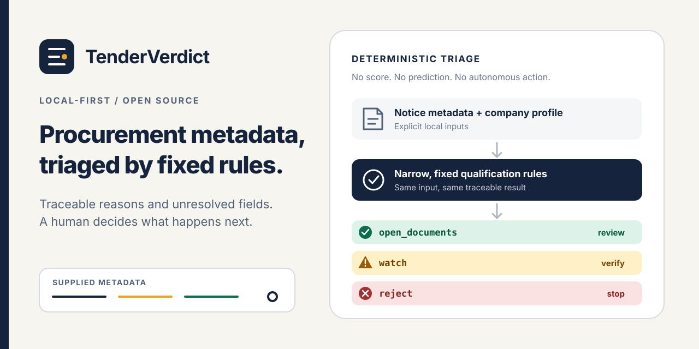
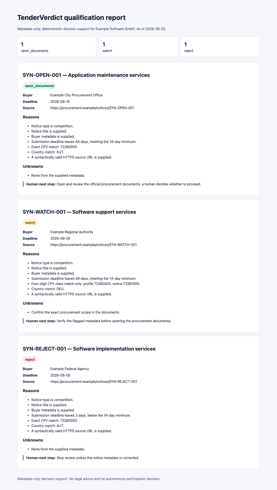

<p align="center">
  
</p>

<h1 align="center">TenderVerdict</h1>

<p align="center"><strong>Explainable procurement metadata triage, run locally.</strong></p>

<p align="center">
  <a href="https://github.com/demidgost-sys/tenderverdict/actions/workflows/ci.yml"></a>
  &nbsp;·&nbsp; <a href="https://github.com/demidgost-sys/tenderverdict/releases/tag/v0.2.0-alpha.1">v0.2.0-alpha.1</a>
  &nbsp;·&nbsp; Python 3.11+
  &nbsp;·&nbsp; <a href="LICENSE">Apache-2.0</a>
</p>

<p align="center">
  <a href="#quick-start">Quick start</a> ·
  <a href="#desktop-preview">Desktop preview</a> ·
  <a href="#example-output">Example output</a> ·
  <a href="#portfolio-workspace-json">Portfolio Workspace</a> ·
  <a href="#next-gen-macos-shell">Next Gen macOS</a> ·
  <a href="#verdicts">Verdicts</a> ·
  <a href="ROADMAP.md">Roadmap</a> ·
  <a href="LIMITATIONS.md">Limitations</a> ·
  <a href="CONTRIBUTING.md">Contributing</a>
</p>

TenderVerdict is experimental open-source software for supplier-side pre-qualification of
public-procurement **notice metadata**. The published developer alpha contains a CLI, Python
library, and an unsigned local desktop preview. You supply a company profile and structured notices;
TenderVerdict applies narrow, deterministic rules and produces a review queue with reasons,
unresolved fields, and a human next step.

It does not read full procurement documents or decide whether you should bid.

| Property | What it means |
|---|---|
| **Local-first** | `demo`, `qualify`, and `portfolio` read local files and make no network requests. |
| **Deterministic** | The same inputs and explicit `--as-of` review point produce the same verdicts. |
| **Traceable** | Reports preserve reasons, unknowns, source metadata, generator version, and input SHA-256 digests. |
| **Fail closed** | Invalid input or a failed fetch returns an error without publishing partial output. |
| **Small footprint** | The installed package has no runtime dependencies. |

> [!IMPORTANT]
> `v0.2.0-alpha.1` is an unsigned developer alpha, not a consumer installer. Interfaces and rules
> may change. Start with the bundled synthetic example, avoid confidential inputs, and do not
> disable operating-system security controls to run an archive.

## Release status

| Surface | Current state | Installation path |
|---|---|---|
| CLI and library | Published as `v0.2.0-alpha.1` | Versioned source tag below |
| Desktop UI | Published developer alpha | Source with Tk or unsigned native archive |
| macOS archives | CI-tested; arm64 flow completed hands-on | Opt-in evaluation only |
| Windows x64 archive | Native CI and frozen smoke test passed; no hands-on run yet | Experimental opt-in evaluation |
| Portfolio Workspace CLI | Unreleased source feature | Current source checkout only |
| Next Gen SwiftUI shell | Unreleased, source-buildable competition feature | macOS source checkout only |

There is no trusted one-click installer, hosted service, account system, telemetry, or automatic
update channel. See [`ROADMAP.md`](ROADMAP.md) for the evidence gates and evaluation thresholds.

## Quick start

Requires Python 3.11 or newer. The commands below install the immutable developer alpha in an
isolated virtual environment.

### macOS or Linux

```bash
git clone --branch v0.2.0-alpha.1 --depth 1 \
  https://github.com/demidgost-sys/tenderverdict.git
cd tenderverdict
python3 -m venv .venv
.venv/bin/python -m pip install .
.venv/bin/tenderverdict demo
```

### Windows PowerShell

```powershell
git clone --branch v0.2.0-alpha.1 --depth 1 `
  https://github.com/demidgost-sys/tenderverdict.git
cd tenderverdict
py -m venv .venv
.venv\Scripts\python -m pip install .
.venv\Scripts\tenderverdict demo
```

Once installed, the demo is fully offline and returns exactly one example of each verdict.
Installing from source may download the pinned build tool if it is not already cached.

## Desktop developer alpha

The desktop preview removes the need to edit the supplier profile by hand. It
provides labelled fields for the supplier criteria, immediate validation for normalized CSV or
JSON notice data, an editable CSV example, an explicit review point, verdict filters, sortable
results, plain-text copy, and atomic HTML, Markdown, or JSON export.

It uses the same deterministic workflow as the CLI. It does not upload data, fetch TED metadata,
open source URLs automatically, or make a participation decision.

Run it from source:

```bash
git clone https://github.com/demidgost-sys/tenderverdict.git
cd tenderverdict
python3 -m venv .venv
.venv/bin/python -m pip install .
.venv/bin/tenderverdict desktop
```

Or download the archive and matching `.sha256` file for `macos-arm64`, `macos-x64`, or
`windows-x64` from the
[`v0.2.0-alpha.1` prerelease](https://github.com/demidgost-sys/tenderverdict/releases/tag/v0.2.0-alpha.1).
Read `START_HERE.txt` and verify the checksum before extracting. These archives are unsigned:
macOS lacks Developer ID signing and notarization, and Windows lacks Authenticode signing. If the
operating system does not accept an archive normally, use the source workflow or stop the test;
do not weaken Gatekeeper, SmartScreen, antivirus, or another security control. See
[`DESKTOP.md`](DESKTOP.md) for the complete trust, privacy, build, and accessibility boundaries.

Completed an independent packaged run? Share the target, commit, completed steps, and first blocker
in the opt-in [desktop feedback issue](https://github.com/demidgost-sys/tenderverdict/issues/9).
Use only synthetic, public, or fully de-identified material.

## Example output

| Verdict | Why it appears | Human next step |
|---|---|---|
| `open_documents` | Exact CPV and geography match, sufficient lead time, competition notice, valid HTTPS source URL | Open and review the official documents. |
| `watch` | Important metadata is missing or only a broader CPV-family match is available | Resolve the flagged uncertainty first. |
| `reject` | A configured hard stop applies, such as a near deadline or explicit mismatch | Stop unless the metadata is corrected. |

<details>
<summary><strong>View the complete synthetic HTML report</strong></summary>

<p align="center">
  
</p>

The report is generated from fictional data committed to this repository. Reproduce it with:

```bash
tenderverdict demo --format html --output demo/index.html
```

</details>

## Qualify local notice metadata

```bash
tenderverdict qualify \
  --profile examples/synthetic/profile.json \
  --notices examples/synthetic/notices.csv \
  --as-of 2026-08-02 \
  --format markdown \
  --output report.md
```

Use `--format json` for machine-readable output. Notice data can be normalized `.csv` or `.json`.
Validation errors return a non-zero exit code and do not replace an existing output file.

Minimal company profile:

```json
{
  "schema_version": 1,
  "name": "Example Software GmbH",
  "cpv_codes": ["72260000"],
  "countries": ["AUT", "DEU"],
  "minimum_days_to_deadline": 14
}
```

### Portfolio Workspace JSON

> [!NOTE]
> Portfolio Workspace is an unreleased source feature and is not present in the immutable
> `v0.2.0-alpha.1` tag. Install the current source checkout to evaluate it.

The additive, offline `portfolio` command evaluates one local notice set independently for one to
five named profiles. It leaves the existing single-profile command and its Markdown, HTML, and JSON
exports unchanged. The combined workspace result is deterministic JSON for a future
entitlement-backed desktop experience:

```bash
tenderverdict portfolio \
  --workspace examples/synthetic/portfolio-workspace.json \
  --notices examples/synthetic/notices.json \
  --as-of 2026-08-02 \
  --output portfolio-report.json
```

The workspace file is a bounded UTF-8 JSON object. It accepts no unknown fields, is limited to
256 KiB, and contains the existing profile schema without introducing a second qualification
model:

```json
{
  "schema_version": 1,
  "profiles": [
    {
      "schema_version": 1,
      "name": "Example Austria Services",
      "cpv_codes": ["72260000"],
      "countries": ["AUT"],
      "minimum_days_to_deadline": 14
    }
  ]
}
```

There must be between one and five profiles. Names are trimmed and must be unique after
case-insensitive comparison. Any invalid nested profile rejects the entire workspace before an
output file is replaced.

Each entry in `profile_reports` is the existing schema-3 report for one profile. The top-level
summary reports only the profile count and the shared input notice count; it does not rank profiles
or combine their verdict totals. Profile and notice input order are preserved. Nested provenance
contains a separate canonical profile digest for each normalized profile and the same notice-file
digest for every profile. The command writes JSON atomically when `--output` is supplied and prints
the same JSON to stdout when it is omitted; it intentionally has no Markdown or HTML portfolio
format yet.

### Next Gen macOS shell

The competition branch now includes an unreleased SwiftUI shell in
[`macos/TenderVerdictNextGen`](macos/TenderVerdictNextGen). It consumes the Portfolio Workspace
JSON instead of reimplementing qualification rules, preserves the first profile as the free
single-analysis surface, and reveals all one to five profile reports only when RevenueCat reports
the `supplier_profiles_plus` entitlement as active.

The Swift package pins the official RevenueCat Apple SDK to `5.83.0` and contains current-offering,
Test Store purchase, restore, and `CustomerInfo` entitlement paths. Configuration is fail-closed:
no key is committed, a missing key makes no RevenueCat request, and the source rejects any key that
does not begin with `test_`. The open-source CLI remains accessible and is not presented as a
tamper-resistant payment boundary.

Build and verify the source on macOS from the repository root:

```bash
swift build --package-path macos/TenderVerdictNextGen
swift run --package-path macos/TenderVerdictNextGen TenderVerdictNextGenChecks
TENDERVERDICT_WORKTREE="$PWD" \
  swift run --package-path macos/TenderVerdictNextGen TenderVerdictNextGen --smoke-test
```

The checks require no API key and the smoke test makes no RevenueCat request. They establish source
compilation, SDK linkage, the free/Premium projection, and consumption of the real synthetic
portfolio command. They are not evidence of a Test Store transaction, entitlement activation,
restore, packaged application, or Shipaton eligibility. See the
[`Next Gen source README`](macos/TenderVerdictNextGen/README.md) and
[`Shipaton evidence record`](docs/SHIPATON_EVIDENCE.md) for the remaining gates.

The complete CSV header is:

```text
publication_number,lot_id,notice_type,title,buyer,cpv_codes,countries,deadline,deadline_at,publication_date,source_url
```

`publication_number` is required. A notice-level row must be unique case-insensitively; distinct
lot-level rows may share it when each has a unique official `lot_id`. `lot_id`, `deadline_at`, and
`publication_date` are optional, so the shorter v0.1 header remains accepted. Do not mix a
notice-level row and lot-level rows for the same publication.

Use `deadline` for a `YYYY-MM-DD` calendar date, or leave it empty and use `deadline_at` for an
RFC 3339 timestamp with an explicit UTC offset. Supplying both is an error. `--as-of` accepts the
same date-or-timestamp distinction. A date-only review point becomes `watch` when an exact
timestamp falls on a boundary that cannot be resolved without a review instant.
Use `|` inside `cpv_codes` or `countries` when a row has multiple values, for example
`72260000|72261000` or `AUT|DEU`. Comma-, semicolon-, and tab-separated files are accepted; the
bundled example uses commas. CSV is treated as data, never as executable spreadsheet content.

A notices file may contain at most 1,000 records and 10 MiB. Text fields and value lists also have
explicit bounds. A valid header-only CSV and an empty JSON array both produce a zero-notice report;
validation or network failure remains an error and never means "zero matches". JSON, Markdown, and
HTML reports include provenance; the JSON report format in `0.2.0a1` is schema version 3.
Eight-digit CPV values and three-letter country values are checked offline against the bundled,
source-traceable EU vocabulary snapshots described in [`DATA_SOURCES.md`](DATA_SOURCES.md).

See [`examples/synthetic`](examples/synthetic) for matching CSV and JSON fixtures and a
reproducible report.

## Verdicts

The qualification rules are deliberately narrow:

- `reject` — a closed or near deadline, explicit CPV/country mismatch, or non-competition notice;
- `watch` — missing important metadata, an invalid source URL, or only a CPV-family match;
- `open_documents` — exact CPV and geography match, sufficient lead time, competition notice, and
  a syntactically valid absolute HTTPS source URL.

`open_documents` means only that the configured metadata checks passed. TenderVerdict does not
provide legal advice, determine eligibility, compare bidders, predict outcomes, recommend bidding,
or take an autonomous procurement action. Read [`LIMITATIONS.md`](LIMITATIONS.md) before applying
the output to real work.

Calendar-date deadlines retain the v0.1 rule: a deadline equal to a date-only `--as-of` is treated
as closed. Exact `deadline_at` timestamps are compared in UTC when `--as-of` is also an RFC 3339
instant; unresolved date-only boundary cases become `watch` instead of being guessed.

## Optional TED metadata fetch

`fetch-ted` is an explicit, read-only network operation. The demo, local qualification, tests, and
CI do not use it.

```bash
tenderverdict fetch-ted \
  --query "classification-cpv = 72260000 SORT BY publication-date DESC" \
  --max-notices 10 \
  --output notices.json
```

The adapter uses the fixed HTTPS TED Search API endpoint, bounded pagination and response limits,
and atomic output replacement after a complete successful fetch. Its JSON snapshot records the
query, UTC retrieval time, endpoint, and lot policy, and can be passed directly to `qualify`.

TED Search API rows are notice-level. For a multi-lot result, TenderVerdict retrieves that notice's
bounded official eForms XML from a fixed TED HTTPS URL and emits one normalized row per verified
lot. Search and XML lot identifiers must agree exactly or the whole fetch fails without replacing
output. A zero-lot result still withholds scope-ambiguous evidence and becomes a human-review case.
The number of XML documents and expanded rows is bounded. Review
[`DATA_SOURCES.md`](DATA_SOURCES.md) and the current source terms before relying on fetched metadata.

## Development

```bash
PYTHONPATH=src python3 -m unittest discover -s tests -v
python3 tools/check_public_tree.py
python3 tools/security_scan.py
ruff check .
ruff format --check .
mypy
swift build --package-path macos/TenderVerdictNextGen
swift run --package-path macos/TenderVerdictNextGen TenderVerdictNextGenChecks
```

The functional test suite is offline; TED behaviour is tested with mocked HTTP responses.
Reproducible bug reports and research feedback are welcome through
[`GitHub Issues`](https://github.com/demidgost-sys/tenderverdict/issues). There is no guaranteed
support or response time during the alpha period.

Read [`ROADMAP.md`](ROADMAP.md), [`CONTRIBUTING.md`](CONTRIBUTING.md),
[`SECURITY.md`](SECURITY.md), and [`CODE_OF_CONDUCT.md`](CODE_OF_CONDUCT.md) before contributing.

## Deutsch

TenderVerdict ist ein experimentelles, quelloffenes und lokal ausgeführtes Werkzeug zur
Vorqualifizierung von Metadaten öffentlicher Ausschreibungen aus Sicht von Anbietern. Ein lokales
Unternehmensprofil und strukturierte Notice-Daten aus CSV oder JSON werden nachvollziehbar als
`open_documents`, `watch` oder `reject` eingeordnet. Das Werkzeug bietet keine Rechtsberatung,
trifft keine Vergabe- oder Teilnahmeentscheidung und ersetzt nicht die Prüfung der
Ausschreibungsunterlagen. `v0.2.0-alpha.1` enthält das CLI und eine unsignierte Desktop-Vorschau;
der aktuelle Quellstand ergänzt außerdem einen noch unveröffentlichten Portfolio-JSON-Workflow.

## License and attribution

The code is licensed under the [`Apache License 2.0`](LICENSE). Procurement records, TED names,
logos, interfaces, and source data are not relicensed by this repository. See [`NOTICE`](NOTICE)
and [`DATA_SOURCES.md`](DATA_SOURCES.md).

Maintained by [Demid Valiullin](https://github.com/demidgost-sys) in Graz, Austria.
