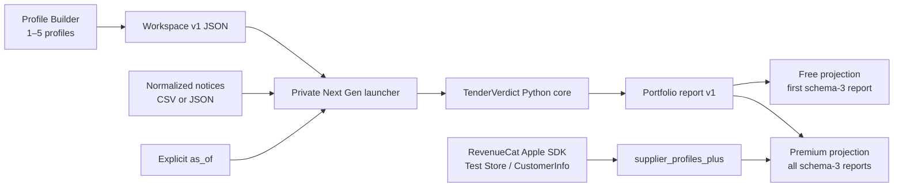

# Architecture

TenderVerdict keeps qualification logic in one deterministic Python core and treats every UI as a
presentation layer. The Next Gen macOS app adds RevenueCat-controlled presentation access without
forking the qualification rules.

## Components

| Component | Responsibility | Network |
|---|---|---|
| `src/tenderverdict` | Parse, validate, qualify, serialize, and preserve provenance | None for `demo`, `qualify`, and `portfolio` |
| `tenderverdict fetch-ted` | Explicit bounded metadata retrieval from TED | Yes, only when invoked |
| Tk desktop | Existing single-profile input, review, and HTML/Markdown/JSON export | None |
| `tools/next_gen_core_launcher.py` | Private app bridge for `portfolio`, strict workspace normalization, and bounded notice preview | None |
| `macos/TenderVerdictNextGen` | Profile Builder, import preview, local continuity, Free/Premium review, and RevenueCat states | RevenueCat only in an explicitly configured Debug evaluation; Release refuses Test Store configuration before the SDK |
| `TenderVerdictCore` | PyInstaller-frozen copy of the private launcher embedded in the `.app` | None; public CLI, TED, and Tk modules are excluded |
| `tools/build_next_gen.py` | Configuration-specific Swift build, embedded-core build, bundle assembly, ad-hoc signing, native checks, smoke test, zip, checksum | May resolve the exactly pinned Swift package; the produced app and smoke test are offline |

## Qualification flow

1. The workspace parser rejects unknown fields, unsupported schema versions, zero or more than five
   profiles, duplicate normalized names, and any invalid nested profile.
2. Notices are read and validated once. The same ordered objects and one explicit review point are
   passed to every profile.
3. Existing qualification rules create an independent `QualificationRun` for each profile.
4. Each run is serialized as the complete existing schema-3 report. The portfolio envelope adds
   only `profile_count` and the shared input `notice_count`.
5. Canonical profile hashes differ by profile; the notice-file hash is identical across reports.
6. Python report JSON is ASCII-safe and deterministic through stable construction order; canonical
   digest encoding and the native Free schema-3 projection sort keys. CLI file output is atomic
   when a target is selected.

There is deliberately no aggregate verdict total, score, ranking, confidence, or recommended
profile.

## Input preparation contract

Workspace selection and the Profile Builder both converge on
`normalize-workspace --workspace PATH`. The Python parser enforces the 256 KiB limit, strict
envelope and nested profile schemas, one-to-five bound, case-insensitive unique names, authority
tables, normalization, and deterministic ASCII-safe JSON. The builder writes those returned bytes
atomically; Swift's local model is an additional fail-closed decoder, not a second authority.

Notice selection converges on `inspect-notices --notices PATH --limit 5`. The canonical CSV/JSON
parser validates the complete file once and returns an exact schema-1 preview with:

- source kind and full notice count;
- a fixed canonical field list and up to five normalized records in source order;
- per-record warnings that the UI collects into a visible preview warning disclosure;
- full-file missing counts for type, title, buyer, CPV codes, countries, deadline, and source URL.

`deadline` is missing only when both the calendar-date and timestamp fields are absent. Preview
output is capped at 4 MiB, its requested row limit is bounded to 1–20, and malformed input exits
with code `2` and no stdout.

## Native runtime selection

`TenderVerdictProcess` chooses one of two adapters:

1. A packaged app executes `Contents/Resources/TenderVerdictCore/TenderVerdictCore`, the frozen
   private launcher, and bundled synthetic fixtures. It needs neither Python nor a source checkout
   on the evaluator's machine.
2. A source build executes `/usr/bin/env python3 tools/next_gen_core_launcher.py` from
   `TENDERVERDICT_WORKTREE` or a detected source root.

Neither adapter uses a shell. Both expose only `portfolio`, `normalize-workspace`, and
`inspect-notices`, run with a reduced child environment, capture stdout and stderr in bounded
temporary files, cap report output at 64 MiB and stderr at 64 KiB, and terminate work that exceeds
30 seconds. Workspace normalization is capped at 256 KiB and notice preview at 4 MiB.

After `portfolio`, the Swift decoder checks the envelope, nested schema versions, profile order and
names, totals, result-array lengths, verdict counts, unique notice identities, profile hashes, the
shared notice hash, and the complete ordered shared notice metadata before the UI accepts the
report. Workspace and preview responses have their own strict unknown-field, bound, normalization,
and consistency checks.

## Free and Premium contract

- Free presentation calls `visibleProfileReports(premiumUnlocked: false)` and exposes only the
  first profile report, including its complete review queue and a deterministic ASCII-safe schema-3
  export. Its HTML review brief is a deterministic presentation of that same first report.
- Premium presentation requires RevenueCat `CustomerInfo` to report the
  `supplier_profiles_plus` entitlement as active, whether it came from the Test Store transaction
  path or an explicitly granted RevenueCat promotional entitlement. Only then does it add a
  notice-by-profile comparison and all profile summaries plus the exact complete portfolio JSON
  export and an all-profile HTML review brief, without ranking or scoring.
- Free review uses verdict, text, buyer, and deadline-presence filters with progressive disclosure.
  Premium applies text, buyer, and deadline filters to the shared notice identities. Matrix cells
  resolve a profile/result pair by stable IDs, never by the current filtered offset, before opening
  complete result detail.
- Native reason presentation separates existing ordered strings into verdict drivers, unknowns that
  need confirmation, and routine passed checks. This does not rewrite the report or export schema.
- The top-level Portfolio Signal and locked portfolio preview derive only a disagreement count
  across the already validated shared notice order. They reveal no gated reason or profile-report
  content and create no score. Native Free/Premium packaging copy is presentation-only.
- `ShareableReviewBrief` renders only already validated profile reports in original profile and
  notice order. It is a self-contained static HTML projection with inline CSS, no scripts, remote
  assets, telemetry, combined verdict totals, or new qualification logic. Display text is
  control-normalized and HTML-escaped; only `safeSourceURL` values become links. Output is capped at
  64 MiB and written atomically by the app, so a rendering or write failure cannot replace an
  existing brief.
- A configured Debug app accepts only offering `supplier_profiles_plus`, package `$rc_monthly`, and
  product `supplier_profiles_plus_monthly`; it handles cancellation, restores purchases, forces a
  current `CustomerInfo` read on explicit refresh and foreground re-entry, and refreshes access on
  launch. If restore returns an inactive entitlement, the app reloads that exact offering before
  presenting the locked state, so purchase remains recoverable without relaunch. An unexpected
  dashboard shape stays locked.
- Hackathon Judge Access validates one of a bounded set of reviewer codes through a one-way digest,
  derives a dedicated RevenueCat App User ID, and calls the SDK `logIn` path. The code itself never
  toggles Premium: an active `supplier_profiles_plus` entitlement remains mandatory. A promotional
  grant on a known judge identity is additionally bounded in-app to December 31, 2026, even if the
  dashboard grant were accidentally configured for longer. The unlocked UI formats the effective
  `CustomerInfo` expiration in the user's calendar and describes it as an expiration boundary, not
  an inclusive paid-subscription promise.
- Missing Debug configuration makes no RevenueCat request. Non-`test_` keys are rejected before
  SDK configuration. A key pasted into the Debug app is held only for that process and is not
  persisted by TenderVerdict. Release builds expose no key field and refuse Test Store
  configuration before any RevenueCat SDK call.

The Shipaton Manager confirmed that the Test Store path is sufficient and that macOS has no
judging disadvantage: [Test Store answer](https://revenuecat-shipaton-2026.devpost.com/forum_topics/44695-next-gen-eligibility-is-a-test-store-only-purchase-sufficient) and
[macOS answer](https://revenuecat-shipaton-2026.devpost.com/forum_topics/44615-macos-app-submission).

The public CLI can still produce the complete portfolio report. This is intentional open-source
behavior; Premium is the native product experience, not DRM around Apache-2.0 code.

## Report presentation state

The native app distinguishes three presentation states without adding fields to the portfolio
contract:

- **Bundled demo report** — a known synthetic run, currently designed to show one Open, one Watch,
  and one Reject in the first Free profile;
- **Current selected-input report** — a successful run whose source label and `as_of` match the
  accepted presentation inputs;
- **Previous report kept for reference** — retained valid bytes after an accepted input or review
  point changes, or while/after a selected-input rerun that has not succeeded.

The previous report remains exportable to preserve the failure-retention contract, but both the
visible context card and export action identify it as previous. A successful run atomically replaces
the in-memory report bytes, aligns the review-point field to the accepted report, resets report
filters through its profile/notice identity, and returns the presentation to current. Strict native
review-point validation mirrors Python's whole-second date/RFC-3339 grammar before process launch;
the Python parser remains authoritative.

## Local continuity and accessibility

File continuity is opt-in. `WorkspaceContinuity` stores only the selected workspace and notices as
macOS security-scoped bookmarks in app defaults. Disabling the setting removes both bookmarks.
Restored selections are validated again and are never run automatically. Tender contents,
generated report bytes, review dates, and RevenueCat configuration remain session-only.

Premium terminal states map to pure announcement, recovery-action, and focus-target values. When
VoiceOver is enabled and a visible app window exists, the app posts the terminal announcement. It
restores focus only after an explicit user action, avoiding launch-time focus theft. Native cards
also respond to Increase Contrast and Reduce Transparency, while verdict meaning always remains in
text as well as color.
Input-derived profile, notice, buyer, reason, unknown, next-step, warning, path, and status text is
normalized at presentation time so C0, DEL/C1, and Unicode format controls are visible rather than
able to reorder or conceal evidence. Raw report bytes and deterministic exports are not rewritten.

## Failure and privacy boundaries

- Invalid CLI output never replaces an existing file. The Next Gen app preserves its last valid
  report/export after a failed run; the legacy Tk desktop instead clears results when the selected
  local input changes and then validates the new input.
- The packaged core contains no TED adapter, Tk UI, production RevenueCat key, user data,
  first-party telemetry, or account system.
- Local profile and notice data are sent only to the embedded child process. They are not sent to
  RevenueCat.
- RevenueCat receives its normal SDK identifiers and Test Store operations only after the evaluator
  explicitly supplies a Test Store key to a Debug evaluation build. Its normal SDK customer state
  is distinct from TenderVerdict's session-only API-key field and offline input path. Release
  evaluation builds cannot enter or configure that key.
- A submitted Judge Access code is cleared from the SwiftUI field and is not persisted by
  TenderVerdict. RevenueCat's SDK may cache the derived App User ID as its normal customer identity;
  neither the raw reviewer code nor the Test Store API key is written to app defaults, reports, or
  the bundle.
- The app bundle is ad-hoc signed and not notarized. It remains an evaluation artifact.

## Verification layers

| Layer | Evidence |
|---|---|
| Python behavior | Complete offline suite covering the CLI, model, report, desktop, bridge, security, and distribution contracts; current totals live in [project status](PROJECT_STATUS.md) |
| Public tree | Exact allow-list, bounded binary validation, conservative content scan |
| Swift contract | Standalone Debug and Release result, schema, provenance, display-safety, review-point, input-preview, reason grouping, disagreement-count, stable-ID, access/accessibility-outcome, ordering, and deterministic-byte checks |
| Source bridge | Headless synthetic smoke through the private launcher; no RevenueCat configuration |
| Packaged bridge | Builder-enforced `.app` smoke from `/` with no worktree or system Python dependency; embedded normalize/inspect determinism; ad-hoc signature and manifest verification |
| UX | Source implementation includes Profile Builder, import preview, filters, detail, focus, contrast, and transparency handling; refreshed screenshot/settings QA remains separate |
| RevenueCat transaction | Packaged Debug Test Store cancel, failure, purchase, refresh, relaunch, restore, and dashboard evidence; not a real payment |

See [UX and accessibility audit](UX_AUDIT.md) and
[Shipaton evidence](SHIPATON_EVIDENCE.md) for the current result rather than inferring a transaction
from source code.
