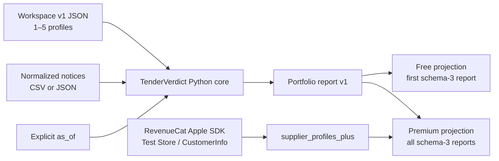

# Architecture

TenderVerdict keeps qualification logic in one deterministic Python core and treats every UI as a
presentation layer. The Next Gen macOS app adds RevenueCat-controlled presentation access without
forking the qualification rules.

## Components

| Component | Responsibility | Network |
|---|---|---|
| `src/tenderverdict` | Parse, validate, qualify, serialize, and preserve provenance | None for `demo`, `qualify`, and `portfolio` |
| `tenderverdict fetch-ted` | Explicit bounded metadata retrieval from TED | Yes, only when invoked |
| Tk desktop | Existing single-profile input, review, and HTML/Markdown/JSON export | None |
| `macos/TenderVerdictNextGen` | Native workspace input, free/Premium projection, and RevenueCat states | Only the RevenueCat SDK after a Test Store key is supplied |
| `TenderVerdictCore` | PyInstaller-frozen, portfolio-only Python runtime embedded in the `.app` | None; TED and Tk modules are excluded |
| `tools/build_next_gen.py` | Release Swift build, embedded-core build, bundle assembly, ad-hoc signing, smoke test, zip, checksum | May resolve the exactly pinned Swift package; the produced app and smoke test are offline |

## Qualification flow

1. The workspace parser rejects unknown fields, unsupported schema versions, zero or more than five
   profiles, duplicate normalized names, and any invalid nested profile.
2. Notices are read and validated once. The same ordered objects and one explicit review point are
   passed to every profile.
3. Existing qualification rules create an independent `QualificationRun` for each profile.
4. Each run is serialized as the complete existing schema-3 report. The portfolio envelope adds
   only `profile_count` and the shared input `notice_count`.
5. Canonical profile hashes differ by profile; the notice-file hash is identical across reports.
6. JSON serialization is ASCII-safe, sorted, deterministic, and atomically written when a target is
   selected.

There is deliberately no aggregate verdict total, score, ranking, confidence, or recommended
profile.

## Native runtime selection

`TenderVerdictProcess` chooses one of two adapters:

1. A packaged app uses `Contents/Resources/TenderVerdictCore/TenderVerdictCore` and bundled
   synthetic fixtures. It does not need Python or a source checkout on the evaluator's machine.
2. A source build uses `python3 -m tenderverdict` from `TENDERVERDICT_WORKTREE` or a detected source
   root.

Both adapters invoke only `portfolio`, capture stdout and stderr in bounded temporary files, cap
report output at 64 MiB, and terminate work that exceeds 30 seconds. The Swift decoder then checks
the envelope, nested schema versions, counts, names, totals, profile hashes, and shared notice hash
before the UI accepts the report.

## Free and Premium contract

- Free presentation calls `visibleProfileReports(premiumUnlocked: false)` and exposes only the
  first profile report.
- Premium presentation requires RevenueCat `CustomerInfo` to report the
  `supplier_profiles_plus` entitlement as active.
- The app loads the current offering, runs the selected Test Store package, handles cancellation,
  restores purchases, and refreshes access on launch.
- Missing configuration makes no RevenueCat request. Non-`test_` keys are rejected before SDK
  configuration. A key pasted into the app is held only for that process and is not persisted by
  TenderVerdict.

The public CLI can still produce the complete portfolio report. This is intentional open-source
behavior; Premium is the native product experience, not DRM around Apache-2.0 code.

## Failure and privacy boundaries

- Invalid input never replaces the previous valid UI result or an existing CLI output file.
- The packaged core contains no TED adapter, Tk UI, production RevenueCat key, user data, telemetry,
  or account system.
- Local profile and notice data are sent only to the embedded child process. They are not sent to
  RevenueCat.
- RevenueCat receives its normal SDK identifiers and Test Store operations only after the evaluator
  explicitly supplies a Test Store key.
- The app bundle is ad-hoc signed and not notarized. It remains an evaluation artifact.

## Verification layers

| Layer | Evidence |
|---|---|
| Python behavior | Offline unit and end-to-end suite |
| Public tree | Exact allow-list, bounded binary validation, conservative content scan |
| Swift contract | Six standalone schema, provenance, access-configuration, and deterministic-byte checks |
| Source bridge | Headless synthetic smoke test through the real `portfolio` command |
| Packaged bridge | `.app` smoke test with no worktree or system Python dependency |
| UX | Hands-on file chooser, local run, export, invalid-input, and missing/rejected-key audit |
| RevenueCat transaction | Pending configured Test Store project and hands-on evidence |

See [UX and accessibility audit](UX_AUDIT.md) and
[Shipaton evidence](SHIPATON_EVIDENCE.md) for the current result rather than inferring a transaction
from source code.
